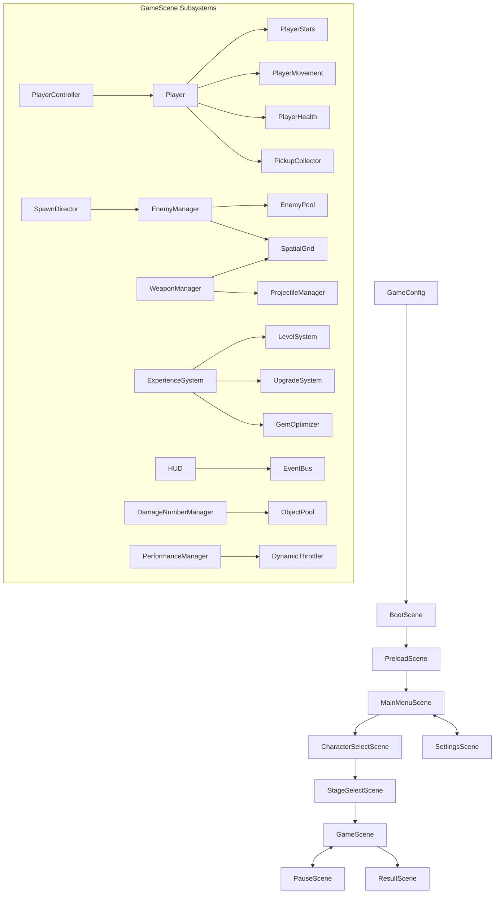

# Technical Architecture — Orbital Survivor

## 1. System Overview

Orbital Survivor is an original 2D survival roguelite action game built with **Phaser 3** (`3.90.0`), **TypeScript**, and **Vite**. The game runs completely client-side in web browsers with zero external network asset dependencies.

---

## 2. Scene Architecture

- **`BootScene`**: Initializes engine configuration and prepares graphics pipeline.
- **`PreloadScene`**: Programmatically generates procedural canvas sprite textures (chassis, bullets, enemies, icons, pickups, floor tiles) and sound synthesizers.
- **`MainMenuScene`**: Sci-fi main interface offering mission deployment, chassis selection, permanent talent workshop, and settings.
- **`CharacterSelectScene`**: Chassis comparison and deployment setup (Aegis-01, Valkyrie-02).
- **`StageSelectScene`**: Sector briefing, wave timeline previews, and survival records.
- **`GameScene`**: Active combat coordinator running the 10-minute survival simulation, enemy waves, targeting, and boss confrontation.
- **`PauseScene`**: Tactical pause modal that freezes physics simulation and timers while preserving UI responsiveness.
- **`ResultScene`**: End-of-run post-mortem displaying survival time, kills, damage dealt, DPS, and persisting credits to localStorage.
- **`SettingsScene`**: Controls for music/SFX volume, damage numbers toggle, screen shake, and graphics quality profiles.

---

## 3. Combat & Weapon Pipeline

- **Authoritative Stats**: `PlayerStats` tracks 15 attributes (`maxHealth`, `moveSpeed`, `armor`, `damageMultiplier`, `attackSpeedMultiplier`, `cooldownReduction`, `criticalChance`, `criticalDamage`, `pickupRadius`, `healthRegeneration`, `projectileSpeedMultiplier`, `projectileSizeMultiplier`, `areaMultiplier`, `durationMultiplier`, `experienceMultiplier`) supporting `Flat`, `AdditivePercent`, and `MultiplicativePercent` modifiers.
- **Unified `DamageInfo`**: Combat operations exchange strongly-typed packets containing damage type (`Physical`, `Energy`, `Explosive`), source, critical flags, knockback force, and hit coordinates.
- **Weapons**:
  1. *Pulse Blaster* (Auto-target linear plasma bolts)
  2. *Orbit Drones* (Rotating kinetic barrier shields)
  3. *Plasma Field* (Continuous circular radiation aura)
  4. *Ricochet Disc* (Chakrams that bounce between hostiles)
  5. *Arc Node* (Lightning arcs jumping across enemies)
  6. *Micro Missile Pod* (Cluster guided explosive missiles)

---

## 4. Object Pooling & Memory Management

Preallocated pools eliminate garbage collection spikes during high-density waves:
- `EnemyPool`: 300 pooled enemies + 150 enemy projectiles.
- `ProjectileManager`: 250 player projectiles and missiles.
- `ExperienceSystem`: 500 pooled EXP gems and credit tokens.
- `DamageNumberManager`: 100 pooled floating text game objects.

---

## 5. Spatial Partitioning

- `SpatialGrid`: 2D spatial hash grid with 128px cell granularity.
- Provides $O(1)$ fast radius queries (`getEntitiesInRadius`), nearest target search (`getNearestEntity`), cluster centroid calculations (`findClusterCenter`), and crowd separation steering.

---

## 6. Save & Persistence Architecture

- `SaveManager`: Serializes player credits, stage completions, unlocked characters, permanent talents, and lifetime statistics into `localStorage`.
- `SaveMigration`: Schema versioning pipeline that guards against corrupted saves and automatically applies default parameters without data loss.
